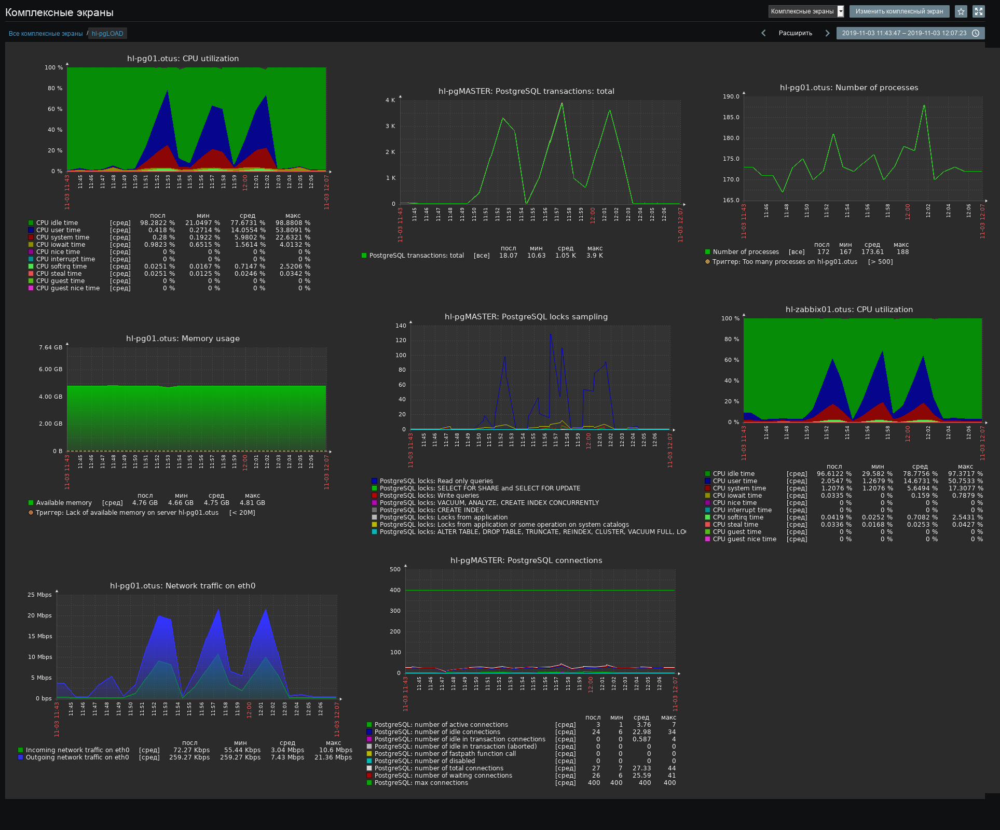

# Тестирование postgresql - HA-кластер web с http-балансировкой

Тесты были направлены на VIP-адрес http-балансировщиков, соответственно, трафик распределялся на два уже оптимизированных web-сервера. Pgbouncer отключён.

```yandex.tank > haproxy > 2 x web > haproxy > postgresql```

## Web-сервера

- оборудование - 2 ядро ЦП и 6 ГБ ОЗУ
- php-fpm - для максимальной производительности установлены параметры:\
  ```pm = static```\
  ```pm.max_children = 800```\
  ```rlimit_files = 8192```\
  в файле ```/etc/systemd/system/php-fpm.service.d/override.conf``` сделаны соответствующие настройки:

  ```bash
  [Service]
  LimitNOFILE=8192
  ```

## Сервера БД - оптимизация и тесты

В результате множества тестов я пришёл к следующим настройкам:

- аппаратная конфигурация:

  4 ядра ЦП и 8 ГБ ОЗУ

- конфигурация postgresql:

  ```bash
  # DB Version: 11
  # OS Type: linux
  # DB Type: oltp
  # Total Memory (RAM): 8 GB
  # CPUs num: 4
  # Connections num: 200
  # Data Storage: hdd
  
  max_connections = 200
  shared_buffers = 2GB
  effective_cache_size = 6GB
  maintenance_work_mem = 512MB
  checkpoint_completion_target = 0.9
  wal_buffers = 16MB
  default_statistics_target = 100
  random_page_cost = 4
  effective_io_concurrency = 2
  work_mem = 5242kB
  min_wal_size = 2GB
  max_wal_size = 4GB
  max_worker_processes = 4
  max_parallel_workers_per_gather = 2
  max_parallel_workers = 4
  synchronous_commit = off
  wal_compression = on
  ```

  ```synchronous_commit = off``` - выключены синхронные коммиты и теперь мастер кластера БД не будет ждать, пока записи из WAL сохранятся на диске мастера и на дисках обоих реплик, прежде чем сообщить клиенту об успешном завершении операции

  ```wal_compression = on``` -  включено сжатие образа полной страницы, записываемого в WAL

- каталог ```pg_stat_tmp``` с данными статистики вынесен в ОЗУ на каждой ноде кластера БД

  ```bash
  systemctl stop patroni && \
  sleep 5 && \
  echo "tmpfs /var/lib/pgsql/11/data/pg_stat_tmp tmpfs noatime,nodiratime,defaults,size=256M,mode=700,uid=26,gid=26" >> /etc/fstab && \
  mount -v /var/lib/pgsql/11/data/pg_stat_tmp && \
  systemctl start patroni
  ```

После выполнения вышеуказанных настроек удалось добиться 125 запросов в секунду (rps) без появления ошибок при заметном снижении инстансов yandex.tank.

**ТЕСТ** [https://overload.yandex.net/224076](https://overload.yandex.net/224076)

- включены huge_pages

**ТЕСТ** [https://overload.yandex.net/224079](https://overload.yandex.net/224079)

- добавление noatime в опции монтирования корневого раздела (xfs) (для ext4 обычно добавляют barrier=0,noatime)

  Первый тест после перезагрузки ОС (62 инстанса yandex.tank)

**ТЕСТ** [https://overload.yandex.net/224081](https://overload.yandex.net/224081)

  Второй тест с накопленной стистикой из первого теста (37 инстансов yandex.tank)

**ТЕСТ** [https://overload.yandex.net/224082](https://overload.yandex.net/224082)

- отключены Transparent Huge Pages и выполнена настройка параметров ядра ОС linux (sysctl)

  ```bash
  echo never > /sys/kernel/mm/transparent_hugepage/defrag;
  echo never > /sys/kernel/mm/transparent_hugepage/enabled;
  echo "vm.hugetlb_shm_group = $(id -g postgres)" >> /etc/sysctl.d/30-postgresql.conf;
  echo "kernel.sched_migration_cost_ns = 5000000" >> /etc/sysctl.d/30-postgresql.conf;
  sysctl -p --system;
  systemctl restart patroni
  ```

  После настройки параметров ядра было выполнено три теста:

**ТЕСТ** [https://overload.yandex.net/224113](https://overload.yandex.net/224113)\
**ТЕСТ** [https://overload.yandex.net/224114](https://overload.yandex.net/224114)\
**ТЕСТ** [https://overload.yandex.net/224115](https://overload.yandex.net/224115)\

  соответствующий комплексный экран

  

  В момент снятия скриншота mamonsu ещё не успел перечитать значение "max connections" и оно всё ещё равно 400, хотя при проведении всех тестов фактически было 200.

## Вывод

В результате различных оптимизационных мероприятий удалось добиться значительного повышения производительности кластера СУБД без увеличения времени между ключевыми точками.

Тем не менее, на графике "hl-pgMASTER: PostgreSQL locks sampling" видно, что основное количество блокировок БД приходится на RO-запросы. Но к сожалению, со стороны приложения (Zabbix) нет возможности каким-либо образом настроить отправку read-only запросов на другой сервер БД. [https://support.zabbix.com/browse/ZBXNEXT-1603](https://support.zabbix.com/browse/ZBXNEXT-1603) Pgbouncer так же не умеет автоматически разделять входящие RW- и RO-запросы на разные ноды. Соответственно, далее нужно проработать вариант перенаправления RO-запросов на реплики с помощью, например, pgpool-II.
