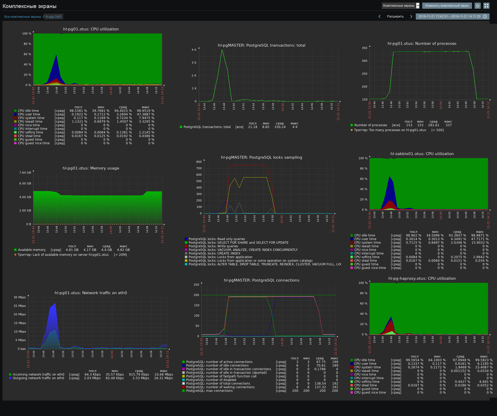
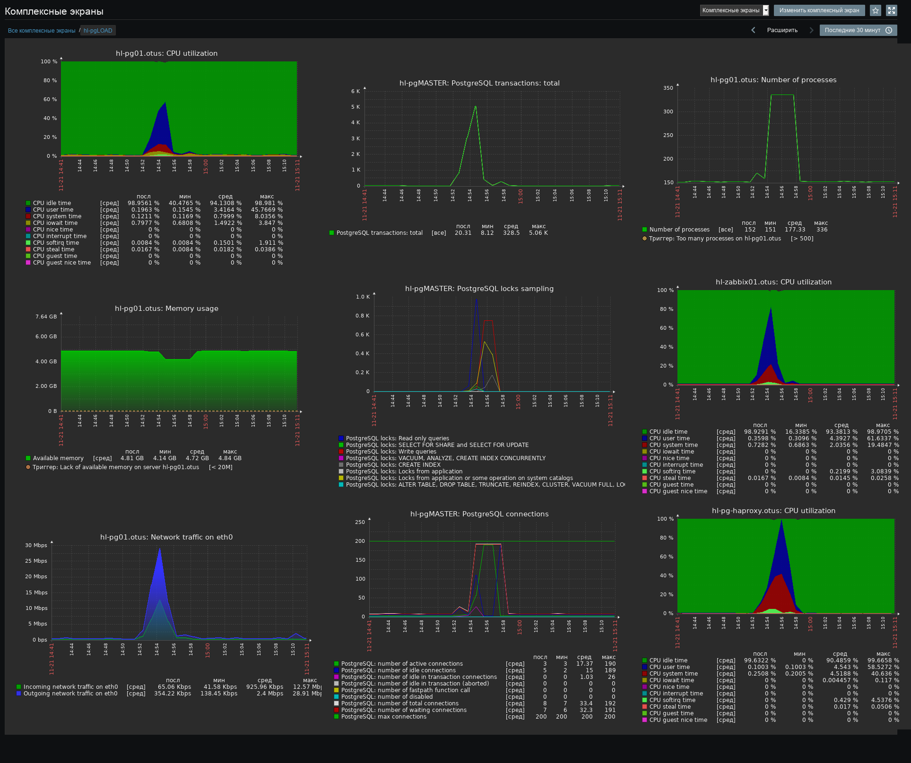

# Тестирование HAProxy, pgbouncer, odyssey

Тесты были направлены на VIP-адрес http-балансировщиков, соответственно, трафик распределялся на два уже оптимизированных web-сервера.

Выполнены все оптимизации предыдущих этапов. Перед выполнением этого блока тестов сервера БД были перезагружены. Pgbouncer и odyssey были запущены на том же хосте, что и HAProxy и этот сервер имеет 1 ядро ЦП и 1 ГБ ОЗУ.

Во время выполнения предыдущих тестов сервера БД успешно (хотя и почти на пределе) выдерживали увеличение количества запросов в секунду до 125 rps в течении 200 секунд. В связи с этим, параметры текущих тестов были увеличены до 200 rps за 200 секунд.

```yaml
schedule: line(1, 200, 200s)
```

При этом, включён модуль автостопа с условием - остановить тест, если количество ненулевых сетевых кодов в каждую секунду последних 10 секунд больше 25 (абсолютный порог).

```yaml
autostop:
  autostop:
    - net(xx,25,10)
```

На графиках [https://overload.yandex.net](https://overload.yandex.net) зафиксированы всплески инстансов yandex.tank. Сами по себе всплески вызваны ограничением производительности БД. Но количество инстансов всегда не превышает 1000 - это ограничение на количество открытых файлов внутри docker-контейнера yandex.tank. В контексте данных тестов изменять этот параметр я не вижу смысла.

## Тесты 1 (1 ядро ЦП, пул в режиме транзакций)

### HAProxy

```yandex.tank > haproxy > 2 x web > haproxy > postgresql```

На мастер-сервере БД количество установленных соединений достигло предела 200 единиц и после этого в 13:06:23 появились коды net_110. На графиках это видно.

```log
2019-11-21 13:06:13.550 MSK [3441] ВАЖНО:  оставшиеся слоты подключений зарезервированы для подключений суперпользователя (не для репликации)
2019-11-21 13:06:13.556 MSK [3438] ВАЖНО:  оставшиеся слоты подключений зарезервированы для подключений суперпользователя (не для репликации)
2019-11-21 13:06:13.561 MSK [3447] ВАЖНО:  извините, уже слишком много клиентов
```

[https://overload.yandex.net/229091](https://overload.yandex.net/229091)

соответствующий комплексный экран


В качестве эксперимента, в настройках подключений к серверам БД выставил ограничение в 190 подключений и провёл ещё один тест.

```
server postgresql_pg01_5432 hl-pg01.otus:5432 maxconn 190 check port 8008
server postgresql_pg02_5432 hl-pg02.otus:5432 maxconn 190 check port 8008
server postgresql_pg03_5432 hl-pg03.otus:5432 maxconn 190 check port 8008
```

И получил такую картину с обилием 502 ошибок:

[https://overload.yandex.net/229920](https://overload.yandex.net/229920)

### pgbouncer

```yandex.tank > haproxy > 2 x web > pgbouncer > postgresql```

Для пользователя zabbix пул настроен в режиме транзакций.

В логах БД уже нет сообщений о нехватке свободных подключений. Но из-за того, что pgbouncer работал недостаточно быстро (медленнее, чем haproxy без ограничений коннектов) и поставил в очередь часть запросов, появились следующие проблемы:

Логи сервера БД:

```sql
2019-11-21 13:48:09.462 MSK [15933] ОШИБКА:  обнаружена взаимоблокировка
2019-11-21 13:48:09.462 MSK [15933] ПОДРОБНОСТИ:  Процесс 15933 ожидает в режиме ShareLock блокировку "транзакция 6992169"; заблокирован процессом 15952.
        Процесс 15952 ожидает в режиме ShareLock блокировку "транзакция 6992166"; заблокирован процессом 15933.
        Процесс 15933: UPDATE profiles SET value_id='30', type=1 WHERE userid=2 AND idx='web.screens.elementid' AND idx2='0'
        Процесс 15952: UPDATE profiles SET value_id='23', type=1 WHERE userid=2 AND idx='web.screens.elementid' AND idx2='0'
2019-11-21 13:48:09.462 MSK [15933] ПОДСКАЗКА:  Подробности запроса смотрите в протоколе сервера.
2019-11-21 13:48:09.462 MSK [15933] КОНТЕКСТ:  при блокировке кортежа (0,36) в отношении "profiles"
2019-11-21 13:48:09.462 MSK [15933] ОПЕРАТОР:  UPDATE profiles SET value_id='30', type=1 WHERE userid=2 AND idx='web.screens.elementid' AND idx2='0'
```

Вполне ожидаемо, что в логах zabbix-server появились slow query.

После окончания тестов pgbouncer всё еще продолжал держать клинетские и серверные соединения в своём пуле:

```sql
pgbouncer=# show pools;
 database  |   user    | cl_active | cl_waiting | sv_active | sv_idle | sv_used | sv_tested | sv_login | maxwait | maxwait_us |  pool_mode
-----------+-----------+-----------+------------+-----------+---------+---------+-----------+----------+---------+------------+-------------
 pgbouncer | pgbouncer |         1 |          0 |         0 |       0 |       0 |         0 |        0 |       0 |          0 | statement
 postgres  | postgres  |         1 |          0 |         1 |       0 |       0 |         0 |        0 |       0 |          0 | session
 zabbix    | postgres  |         1 |          0 |         1 |       0 |       0 |         0 |        0 |       0 |          0 | session
 zabbix    | zabbix    |       195 |        176 |       187 |       0 |       0 |         0 |        0 |      20 |     277784 | transaction
(4 rows)

pgbouncer=# show databases;
   name    |     host     | port | database  | force_user | pool_size | reserve_pool | pool_mode | max_connections | current_connections | paused | disabled
-----------+--------------+------+-----------+------------+-----------+--------------+-----------+-----------------+---------------------+--------+----------
 pgbouncer |              | 5000 | pgbouncer | pgbouncer  |         2 |            0 | statement |               0 |                   0 |      0 |        0
 postgres  | hl-pg01.otus | 5432 | postgres  |            |         4 |            0 |           |               0 |                   1 |      0 |        0
 zabbix    | hl-pg01.otus | 5432 | zabbix    |            |       187 |            0 |           |               0 |                 188 |      0 |        0
(3 rows)
```

[https://overload.yandex.net/229107](https://overload.yandex.net/229107)

Нагрузка на ЦП мастер-сервера БД заметно снизилась:


### odyssey

```yandex.tank > haproxy > 2 x web > odyssey > postgresql```

Для пользователя zabbix пул настроен в режиме транзакций.

В логах БД, нет сообщений о нехватке свободных подключений, но появились блокировки.

```sql
2019-11-21 14:54:48.778 MSK [18012] ОШИБКА:  обнаружена взаимоблокировка
2019-11-21 14:54:48.778 MSK [18012] ПОДРОБНОСТИ:  Процесс 18012 ожидает в режиме ShareLock блокировку "транзакция 7024549"; заблокирован процессом 17953.
        Процесс 17953 ожидает в режиме ExclusiveLock блокировку "кортеж (6,11) отношения 17857 базы данных 16387"; заблокирован процессом 17930.
        Процесс 17930 ожидает в режиме ShareLock блокировку "транзакция 7024554"; заблокирован процессом 18012.
        Процесс 18012: UPDATE profiles SET value_id='30', type=1 WHERE userid=2 AND idx='web.screens.elementid' AND idx2='0'
        Процесс 17953: UPDATE profiles SET value_id='30', type=1 WHERE userid=2 AND idx='web.screens.elementid' AND idx2='0'
        Процесс 17930: UPDATE profiles SET value_id='30', type=1 WHERE userid=2 AND idx='web.screens.elementid' AND idx2='0'
2019-11-21 14:54:48.778 MSK [18012] ПОДСКАЗКА:  Подробности запроса смотрите в протоколе сервера.
2019-11-21 14:54:48.778 MSK [18012] КОНТЕКСТ:  при перепроверке изменённого кортежа (7,8) в отношении "profiles"
2019-11-21 14:54:48.778 MSK [18012] ОПЕРАТОР:  UPDATE profiles SET value_id='30', type=1 WHERE userid=2 AND idx='web.screens.elementid' AND idx2='0'
```

Так же, в логах zabbix-server появились slow query.

Пул коннектов odyssey:

```sql
console=> show pools;
 database |   user   | cl_active | cl_waiting | sv_active | sv_idle | sv_used | sv_tested | sv_login | maxwait | maxwait_us |  pool_mode
----------+----------+-----------+------------+-----------+---------+---------+-----------+----------+---------+------------+-------------
 zabbix   | zabbix   |        62 |        347 |        62 |     125 |       0 |         0 |        0 |       0 |          0 | transaction
 postgres | postgres |         1 |          0 |         1 |       0 |       0 |         0 |        0 |       0 |          0 | session
 postgres | postgres |         1 |          0 |         1 |       0 |       0 |         0 |        0 |       0 |          0 | session
 console  | odyssey  |         0 |          1 |         0 |       0 |       0 |         0 |        0 |       0 |          0 | session
(4 rows)
```

Odyssey показал результат немного лучше, чем pgbouncer, но хуже, чем haproxy (БД без пулера соединений).
[https://overload.yandex.net/229168](https://overload.yandex.net/229168)

Нагрузка на ЦП мастер-сервера БД примерно на том же уровне, что и при использовании pgbouncer. Примерно на 1000 увеличилось количество обработанных транзакций. Но увеличилась нагрузка на ЦП сервера, на котором запущен odyssey. В связи с этим, на этот сервер имеет смысл добавить ещё одно ядро ЦП и повторить тест, ожидая повышение производительности.


------

При проведении дальнейших тестов в БД участились взаимные блокировки. В связи с этим, было выполнено сжатие раздутых таблиц и индексов и уменьшение физического размера файлов БД.

[files/03_db02_vacuum.md](files/03_db02_vacuum.md)

------

## Тесты 2 (2 ядра, пул в режиме сессий)

### HAProxy

закончились коннекты
ошибки net_110

[https://overload.yandex.net/229794](https://overload.yandex.net/229794)

### odyssey

#### пул - сессии

дедлоков нет
slow query нет

[https://overload.yandex.net/229642](https://overload.yandex.net/229642)

#### пул - транзакции

дедлоки есть
slow query есть

[https://overload.yandex.net/229652](https://overload.yandex.net/229652)

### pgbouncer

#### пул - сессии

дедлоков нет
slow query нет
ошибки сети нет

[https://overload.yandex.net/229800](https://overload.yandex.net/229800)

повторный тест
дедлоки есть
ошибки net_110 есть

[https://overload.yandex.net/229815](https://overload.yandex.net/229815)

#### пул - транзакции

slow query есть
ошибки net_110
ошибки http 502
дедлоков нет

[https://overload.yandex.net/229767](https://overload.yandex.net/229767)

## Вывод

В целом, odyssey показывает приблизительно такой же результат, что pgbouncer.
Во время тестов с pgbouncer и odyssey на web-серверах LA увеличивался до 38 - ЦП был нагружен на 100% при количестве процессов 984 (php-fpm children\`s) и почти полном использовании ОЗУ. В связи с этим, на этих серверах стоит увеличить количество ядер ЦП с 2 до 4 и ОЗУ с 6 ГБ до 6,5 ГБ.