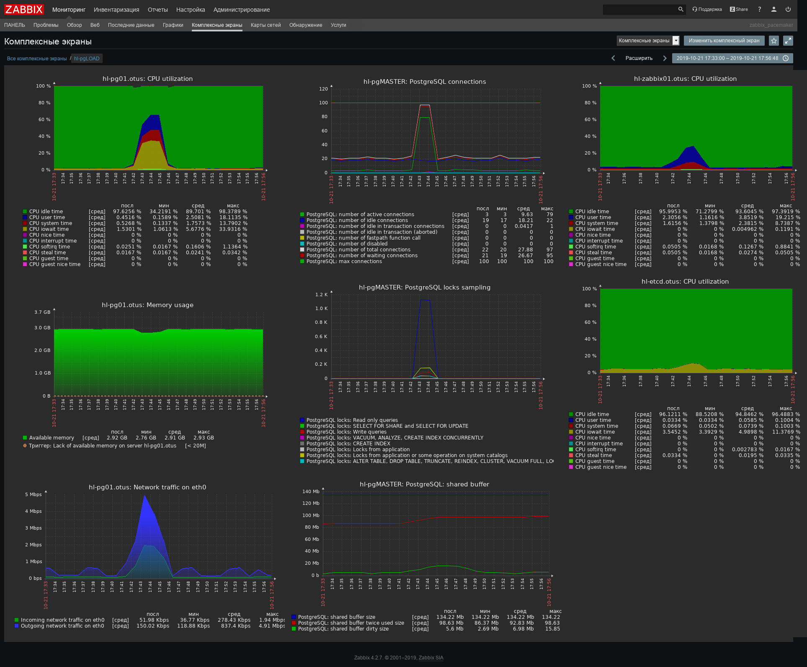
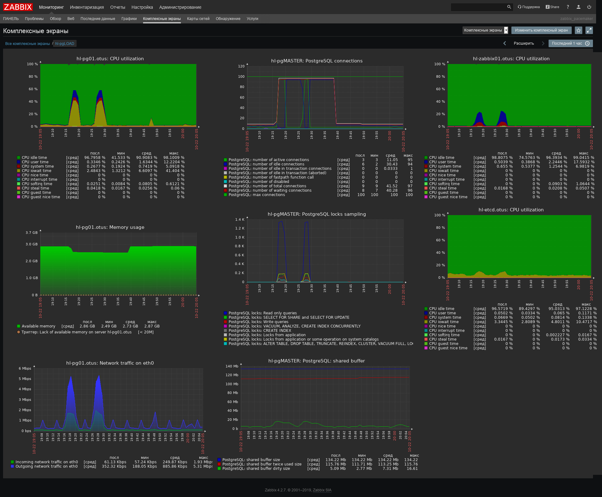

# Тестирование web - HA-кластер с http-балансировкой

Тесты были направлены на VIP-адрес http-балансировщиков, соответственно, трафик распределялся на два уже оптимизированных web-сервера. Так как количество запросов к БД возрастёт, то очевидно, что в результатах тестов узким местом будет являться БД, коим она и являлась на [предыдущем этапе](web01.md).

Web-сервера имеют 1 ядро ЦП и 2 ГБ ОЗУ.
Сервера БД - 2 ядра ЦП и 3 ГБ ОЗУ.

Конфигурация БД - по-умолчанию.

## Тесты

### оптимизированный web + http-балансировка

```web > haproxy > postgresql```

https://overload.yandex.net/221060

и нагрузка на ВМ



Из графиков видно, что, как и предполагалось, производительность стенда упёрлась в БД. В частности, iowait на сервере БД достигает 33,9% и количество возможных подключений к БД достигло максимального значения для текущей конфигурации БД, что подтверждается логами:

```bash
[root@hl-pg01 log]# tail -f -n 3 postgresql-Mon.log 
2019-10-21 17:45:03.162 MSK [27963] ВАЖНО:  оставшиеся слоты подключений зарезервированы для подключений суперпользователя (не для репликации)
2019-10-21 17:45:03.177 MSK [27964] ВАЖНО:  оставшиеся слоты подключений зарезервированы для подключений суперпользователя (не для репликации)
2019-10-21 17:45:03.195 MSK [27965] ВАЖНО:  оставшиеся слоты подключений зарезервированы для подключений суперпользователя (не для репликации)
```

### оптимизированный web + http-балансировка + pgbouncer

настройки пула в pgbouncer
zabbix = host=hl-pg01.otus port=5432 pool_size=100

```web > pgbouncer > postgresql```

https://overload.yandex.net/221490

Проводились два теста через небольшой промежуток времени, поэтому графики выглядят так:



```
# DB Version: 11
# OS Type: linux
# DB Type: dw
# Total Memory (RAM): 4 GB
# CPUs num: 2
# Connections num: 200
# Data Storage: hdd

max_connections = 200
shared_buffers = 1GB
effective_cache_size = 3GB
maintenance_work_mem = 512MB
checkpoint_completion_target = 0.9
wal_buffers = 16MB
default_statistics_target = 500
random_page_cost = 4
effective_io_concurrency = 2
work_mem = 2621kB
min_wal_size = 4GB
max_wal_size = 8GB
max_worker_processes = 2
max_parallel_workers_per_gather = 1
max_parallel_workers = 2
```

https://overload.yandex.net/222008


```
# DB Version: 11
# OS Type: linux
# DB Type: dw
# Total Memory (RAM): 4 GB
# CPUs num: 2
# Connections num: 400
# Data Storage: hdd

max_connections = 400
shared_buffers = 1GB
effective_cache_size = 3GB
maintenance_work_mem = 512MB
checkpoint_completion_target = 0.9
wal_buffers = 16MB
default_statistics_target = 500
random_page_cost = 4
effective_io_concurrency = 2
work_mem = 1310kB
min_wal_size = 4GB
max_wal_size = 8GB
max_worker_processes = 2
max_parallel_workers_per_gather = 1
max_parallel_workers = 2
```

https://overload.yandex.net/222013


```
# DB Version: 11
# OS Type: linux
# DB Type: dw
# Total Memory (RAM): 4 GB
# CPUs num: 2
# Connections num: 600
# Data Storage: hdd

max_connections = 600
shared_buffers = 1GB
effective_cache_size = 3GB
maintenance_work_mem = 512MB
checkpoint_completion_target = 0.9
wal_buffers = 16MB
default_statistics_target = 500
random_page_cost = 4
effective_io_concurrency = 2
work_mem = 873kB
min_wal_size = 4GB
max_wal_size = 8GB
max_worker_processes = 2
max_parallel_workers_per_gather = 1
max_parallel_workers = 2
```

https://overload.yandex.net/222011